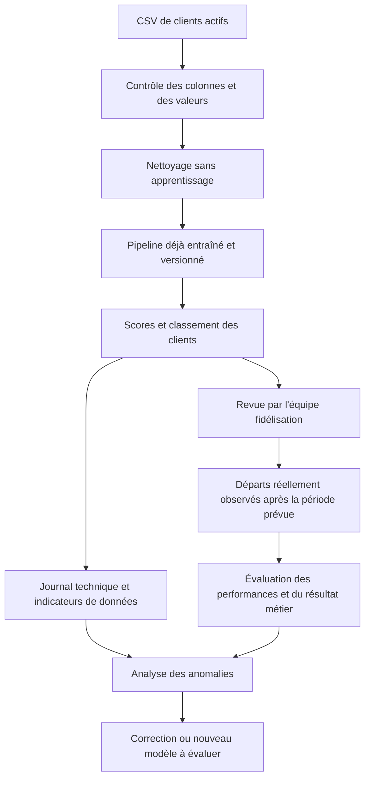

# Déploiement et monitoring - Soutenance Churn

## 1. Ce qui existe et ce qui est proposé

Le professeur demande une « possibilité de déploiement » et mentionne le monitoring. Cette partie présente une solution concrète à construire à partir du projet actuel.

| Élément | État du projet |
|---|---|
| Nettoyage, entraînement et optimisation | Implémentés et exécutés sur Telco |
| Évaluation, figures et export des métriques | Implémentés et vérifiés |
| Manifeste du calcul des figures | Présent : date, versions, empreinte du CSV et paramètres |
| Sauvegarde du pipeline entraîné | À implémenter |
| Prédiction sur un nouveau fichier de clients sans cible | À implémenter |
| Mise à disposition pour une équipe métier | Proposition ci-dessous, aucun service déployé |
| Surveillance de données récentes et alertes | Plan proposé, aucun monitor actif |

Il faut donc dire « je proposerais » pour le déploiement et le suivi. Les scores mesurés concernent l'évaluation historique sur Telco.

## 2. Scénario d'utilisation proposé

**Utilisateur :** une équipe de fidélisation disposant d'une capacité limitée de contacts.

**Fonctionnement :** une fois par semaine, l'équipe fournit un fichier de clients actifs. Un traitement produit une liste classée par score de risque. L'équipe examine cette liste avant de contacter les clients.

La fréquence hebdomadaire est une hypothèse de fonctionnement, à adapter au rythme de mise à jour des données. Elle ne définit pas à elle seule la période de churn à prédire.

### Condition préalable : définir ce qu'on prédit et à quelle date

La cible Telco décrit un départ observé dans les données historiques. Le découpage aléatoire utilisé dans ce projet ne démontre pas une capacité à anticiper les départs du mois prochain.

Avant une utilisation réelle, il faudrait définir un instant de prédiction et une période d'observation, par exemple le départ dans les 30 jours suivants. On construirait des données où les caractéristiques sont connues à cet instant, puis on évaluerait sur une période ultérieure. « 30 jours » est un exemple de contrat métier, pas une propriété démontrée du modèle actuel.

### Parcours prévu

## 3. Passer du code actuel à la prédiction

### Étape A : sauvegarder l'ensemble du pipeline

Enregistrer la régression logistique retenue avec son prétraitement déjà appris : médianes, catégories, standardisation et coefficients. Sauvegarder uniquement le classifieur ferait perdre la manière dont ses entrées ont été préparées.

Accompagner l'artefact de sa version, des colonnes attendues, des types et unités, de la date d'entraînement, de la version des bibliothèques et du jeu de données utilisé. Le manifeste de visualisation actuel fournit déjà une partie de cette traçabilité, mais il ne contient pas le modèle entraîné.

Pour une démonstration, sauvegarder le pipeline ajusté sur l'entraînement permettrait de conserver la correspondance avec les scores de test actuels. Un modèle réentraîné sur davantage de données serait un nouvel artefact à identifier séparément.

### Étape B : recevoir de nouveaux clients

Le fichier d'entrée contiendrait `customerID` et les 19 caractéristiques explicatives du dataset. Il ne demanderait pas `Churn`, puisque c'est précisément l'information encore inconnue.

Vérifications prévues :

- présence des colonnes attendues et identifiants exploitables ;
- types et unités cohérents, notamment pour l'ancienneté et les montants ;
- distinction entre une cellule vide imputable et une colonne entière absente ;
- comptage des valeurs invalides et des catégories inconnues ;
- détection des identifiants répétés, avec résolution explicite des conflits.

Le code actuel `split_features_target` exige une cible : il ne faut donc pas l'utiliser tel quel dans le futur parcours de prédiction. Il faudrait séparer cette préparation des entrées de la validation de la cible d'entraînement.

Conserver l'identifiant à côté du tableau explicatif pour pouvoir rattacher chaque score au bon client. Si des lignes sont rejetées ou regroupées, conserver un rapport des lignes concernées pour éviter les décalages.

### Étape C : appliquer le modèle sans le réentraîner

Recharger le pipeline sauvegardé, convertir les montants comme à l'entraînement, puis appliquer les transformations apprises et `predict_proba`.

Ne pas recalculer la médiane ou la standardisation sur le fichier des nouveaux clients. Ne pas lancer `fit` à chaque import.

Le modèle utilise des classes pondérées. Le score doit être présenté comme un indicateur de classement ; une valeur de 0,80 n'est pas une garantie que 80 % des clients concernés partiront. Une vérification de calibration serait nécessaire pour cette interprétation.

### Étape D : produire un fichier utilisable

Schéma de sortie proposé, sans valeurs inventées :

| Colonne | Utilité |
|---|---|
| `customerID` | Retrouver le client |
| `score_churn` | Classer les clients selon le score du modèle |
| `rang_priorite` | Donner un ordre de revue à l'équipe |
| `a_examiner` | Appliquer une règle métier explicitement choisie |
| `date_score` | Connaître la date de calcul |
| `version_modele` | Retrouver le modèle ayant produit le score |

Le seuil de 0,50 utilisé dans l'évaluation n'est pas un seuil métier optimisé. Le choix dépendrait du budget de contacts et du coût des erreurs, avec réglage sur une validation séparée. Une règle consistant à examiner les K premiers clients serait également possible si l'équipe dispose d'une capacité fixe.

### Mise à disposition envisagée

Commencer par un traitement de fichiers sur un poste ou serveur interne avec un environnement figé. L'équipe récupérerait le CSV de scores dans un espace à accès limité. Une interface d'import pourrait être ajoutée ensuite ; le projet n'a pas besoin d'un service temps réel pour démontrer cette possibilité.

Les identifiants clients servent au rapprochement métier. Les tableaux de suivi agrégés et les journaux d'erreur devraient éviter de recopier inutilement les données individuelles.

## 4. Ce que je surveillerais

Le monitoring consiste à suivre le fonctionnement du système après sa mise à disposition. Il faut distinguer ce qu'on peut mesurer immédiatement et ce qui attend les départs réellement observés.

| Domaine | Indicateurs | Quand les lire ? | Réaction prévue |
|---|---|---|---|
| Fonctionnement | Succès du traitement, durée, nombre de lignes reçues et exportées | À chaque fichier | Arrêter une sortie incomplète, expliquer l'échec et corriger la cause |
| Structure | Colonnes manquantes, types incompatibles, identifiants répétés | Avant le calcul | Rejeter un fichier structurellement incompatible ; conserver un rapport d'erreurs |
| Qualité des valeurs | Proportions de cellules vides, montants invalides et catégories inconnues | À chaque fichier | Comparer à une référence saine ; vérifier une évolution métier ou un défaut de collecte |
| Profils et scores | Distributions d'ancienneté, contrats et scores ; part des clients signalés | À chaque fichier, avec synthèse périodique | Analyser un changement persistant, sans conclure immédiatement à une baisse de performance |
| Qualité prédictive | Rappel, précision, ROC-AUC et matrice de confusion | Lorsque la période cible est achevée et les résultats connus | Comparer par période et par version, avec les effectifs et l'incertitude |
| Utilité métier | Clients contactés, coût des contacts, départs observés, résultat de la campagne | Après observation de la campagne | Évaluer le bénéfice réel ; une prédiction correcte ne prouve pas une rétention réussie |

Une catégorie inconnue ne fait pas nécessairement échouer le pipeline actuel, grâce à `handle_unknown="ignore"`. Cela reste un signal à suivre : le système peut continuer à calculer tout en devenant moins adapté aux données.

### Règles d'alerte à définir

- **Blocage immédiat :** fichier illisible, colonne requise absente ou impossibilité d'associer les scores aux clients.
- **Alerte de données :** évolution inhabituelle du taux de valeurs manquantes ou de catégories inconnues. Le seuil serait fixé après observation d'une période saine, et non présenté comme une norme universelle.
- **Alerte de performance :** recul persistant sur plusieurs périodes dont les résultats sont complets, avec suffisamment de départs observés pour interpréter la mesure.
- **Action :** le responsable des données vérifie la collecte ; le responsable du modèle analyse les écarts ; l'équipe métier décide de poursuivre ou suspendre l'utilisation de la liste.

Les 78,3 % de rappel et 50,6 % de précision actuels sont des résultats de test historiques, pas des objectifs contractuels de production.

## 5. Quand et comment réentraîner ?

Un changement de distribution n'impose pas automatiquement un réentraînement. Il peut venir d'un fichier erroné, d'une offre nouvelle, de la saisonnalité ou d'une modification de la clientèle.

Le parcours proposé serait :

1. Identifier la cause de l'alerte et corriger d'abord les problèmes de données.
2. Constituer une nouvelle période d'entraînement avec des résultats clients suffisamment observés.
3. Comparer l'ancien et le nouveau modèle sur une période ultérieure réservée à l'évaluation.
4. Vérifier les métriques, le volume d'alertes et l'intérêt métier.
5. Faire valider le remplacement et conserver l'ancienne version pour pouvoir revenir en arrière.

Si une campagne de fidélisation modifie le comportement des clients contactés, elle modifie aussi les départs observés. Pour mesurer son efficacité, il faudrait un dispositif d'évaluation adapté, par exemple une comparaison contrôlée lorsque cela convient au contexte métier.

## 6. Texte oral (environ 90 secondes)

> Pour utiliser ce projet en entreprise, je proposerais un traitement hebdomadaire de fichiers clients. Je sauvegarderais le pipeline complet, avec le prétraitement et la régression logistique, puis je l'appliquerais à de nouveaux clients sans réentraîner le modèle à chaque import.
>
> La sortie serait une liste classée par score avec l'identifiant du client, la date du calcul et la version du modèle. L'équipe de fidélisation pourrait examiner les clients prioritaires selon sa capacité de contact.
>
> Avant une utilisation réelle, il faudrait définir précisément la période de départ à prédire et vérifier le modèle sur des données plus récentes. Le test historique actuel ne suffit pas à démontrer une anticipation des départs futurs.
>
> Pour le suivi, je contrôlerais immédiatement les erreurs de traitement, les valeurs manquantes, les nouvelles catégories et la distribution des scores. Une fois les départs réellement connus, je recalculerais le rappel, la précision et la matrice de confusion.
>
> En cas de dégradation persistante, j'analyserais d'abord la cause. Un nouveau modèle serait comparé à l'ancien avant remplacement. Cette architecture reste une proposition : le projet actuel calcule les modèles et les résultats, mais ne comporte pas encore de service déployé ni de surveillance active.

## 7. Questions possibles du professeur

**Pourquoi sauvegarder le pipeline complet ?**

Pour appliquer exactement les transformations apprises à l'entraînement. Le modèle seul ne suffit pas si les colonnes encodées ou l'échelle des nombres changent.

**Peut-on surveiller le rappel tous les jours ?**

Seulement si les vrais départs correspondant à la période prévue sont déjà connus. Sans cette information, on peut suivre les entrées et les scores, mais pas calculer le rappel réel.

**Qu'est-ce qu'une dérive des données ?**

Un changement des données reçues par rapport à une référence, par exemple davantage de contrats mensuels. Cela mérite une analyse, mais ne prouve pas à lui seul que les prédictions sont devenues mauvaises.

**Pourquoi ne pas réentraîner automatiquement chaque semaine ?**

Les nouveaux résultats clients peuvent être incomplets et un problème peut venir de la collecte. Je proposerais un réentraînement justifié et comparé à une référence avant remplacement.

**Le score de 0,80 signifie-t-il 80 % de chances de partir ?**

Pas sans vérification de calibration sur des données représentatives. Dans ce projet, je le présente d'abord comme un score de classement.

**Le modèle réduit-il déjà le churn ?**

Non. Il détecte des profils associés au churn historique. Il faudrait tester une action de fidélisation et mesurer son efficacité pour démontrer une baisse des départs.

**Le système est-il déjà en ligne ?**

Non. L'entraînement, l'évaluation et les figures fonctionnent en local. Le déploiement et le monitoring décrits ici sont la prochaine étape proposée.
