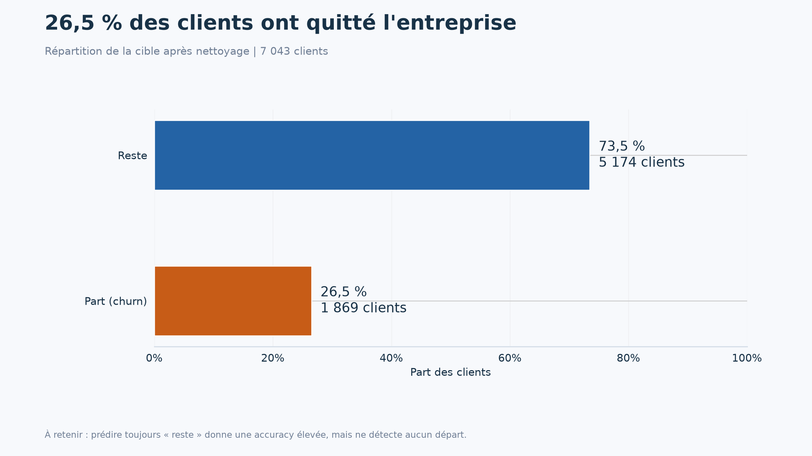
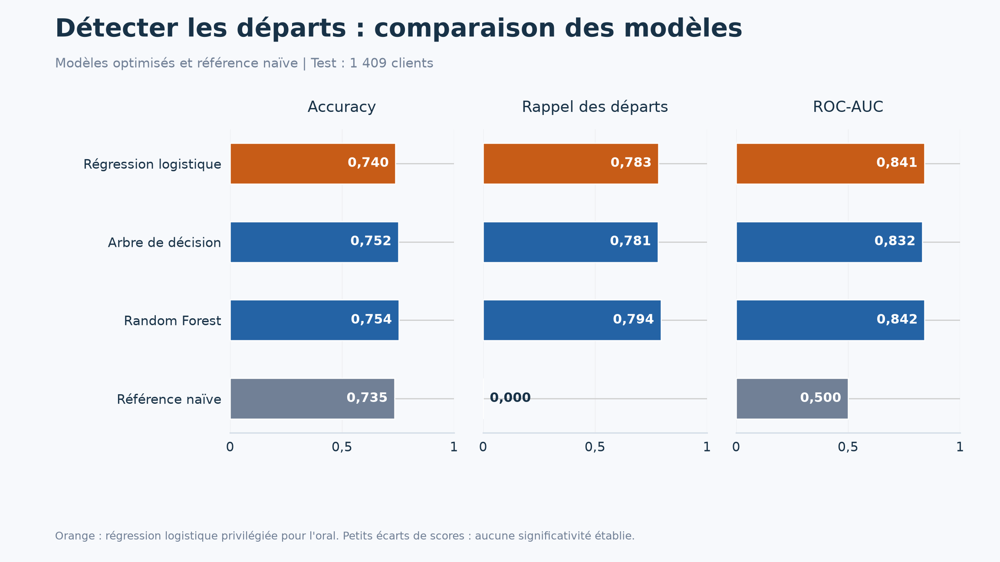
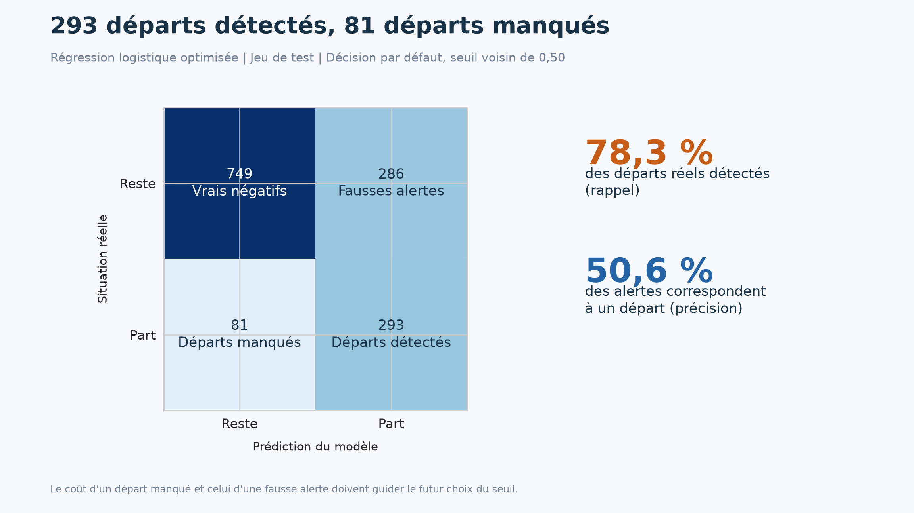
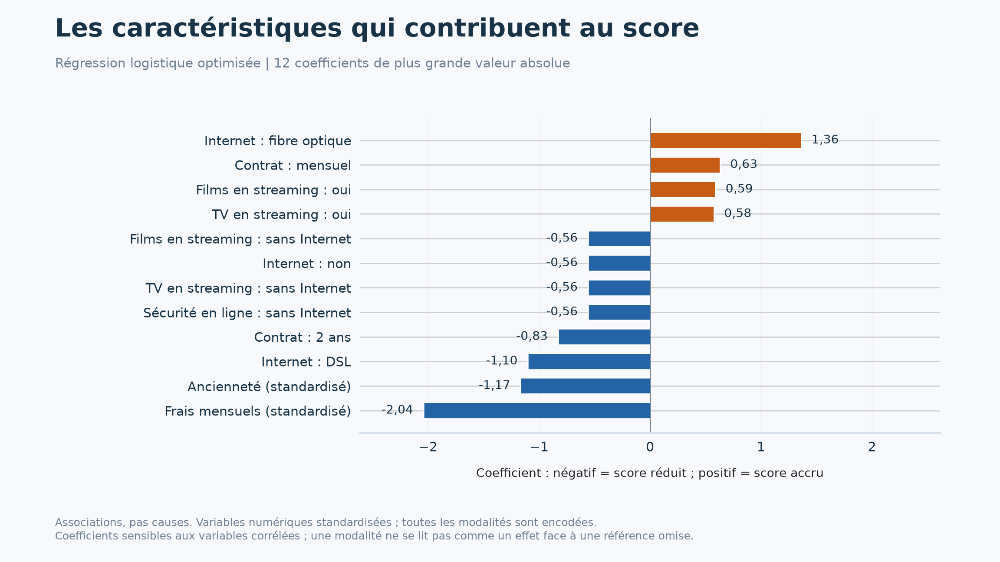

# Les quatre visuels de soutenance

Figures recalculées le 15 septembre 2026 à partir du CSV retrouvé dans Téléchargements. Format 16:9, PNG 2304 × 1296 pixels et PDF vectoriel. Tous les tableaux sources sont conservés avec les graphiques.

## 1. Comprendre le déséquilibre



**À dire :** « Sur 7 043 clients, 1 869 sont partis, soit 26,5 %. Un modèle qui prédit toujours que le client reste paraît correct dans environ trois cas sur quatre, mais ne détecte aucun départ. »

Ce graphique décrit l'ensemble nettoyé. Les graphiques suivants évaluent les modèles sur les 1 409 clients du test.

## 2. Comparer les modèles



**À dire :** « Je compare l'accuracy, le rappel et le ROC-AUC sur le même test. La régression logistique atteint un rappel de 78,3 % et un ROC-AUC de 0,841. La Random Forest atteint 0,842 : cet écart est faible et je n'ai pas établi sa significativité. »

La baseline est en gris. L'orange met en évidence le modèle privilégié pour l'oral, pas un gagnant statistique. Les valeurs sur l'axe vont de 0 à 1 ; par exemple 0,783 correspond à 78,3 % de rappel. Le ROC-AUC est un score de classement, pas un pourcentage de bonnes prédictions.

## 3. Montrer les erreurs concrètes



**À dire :** « Le modèle détecte 293 départs et en manque 81. Il signale aussi à tort 286 clients qui restent. Parmi les alertes, environ une sur deux correspond à un vrai départ. Le coût de ces erreurs doit guider la stratégie de rétention. »

Les lignes indiquent la réalité, les colonnes la prédiction. Rappel : 293 / 374 = 78,3 %. Précision : 293 / 579 = 50,6 %. Les deux mesures répondent à des questions différentes.

## 4. Expliquer ce que le modèle a appris



**À dire :** « Ce graphique montre les 12 coefficients de plus grande valeur absolue. Ils contribuent au score du modèle : vers la droite, contribution positive ; vers la gauche, contribution négative. Ils décrivent des associations et ne prouvent pas de causes. »

### Trois précautions à savoir expliquer

1. Les variables numériques sont standardisées, donc le coefficient ne représente pas l'effet d'un euro ou d'un mois brut.
2. Toutes les catégories sont encodées, sans catégorie de référence supprimée. Un coefficient de catégorie ne s'interprète pas isolément comme un effet face à une référence omise.
3. Des variables sont corrélées. Par exemple, plusieurs colonnes « sans Internet » décrivent les mêmes clients et ont des coefficients identiques. Les frais mensuels ont ici un coefficient négatif, mais cela ne prouve pas qu'une hausse du prix réduit le churn. Le modèle combine déjà prix, services et contrats.

Ce graphique représente des coefficients signés, pas une mesure universelle de l'importance des variables. Le fichier `04_coefficients_complets.csv` contient toutes les colonnes pour vérifier la sélection.

## Reproduire les figures

Depuis la racine du projet, après installation des dépendances :

```bash
python -m src.visualize
```

La commande réentraîne les modèles et actualise les scores, les quatre figures et le manifeste. La dernière section du notebook 2 peut aussi dessiner les figures à partir des modèles déjà entraînés.

Les explications chiffrées de ce document correspondent à l'exécution actuelle ; les réviser si les données ou les réglages changent.
